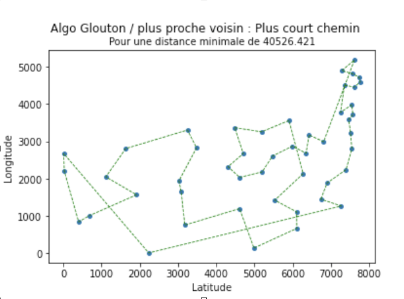
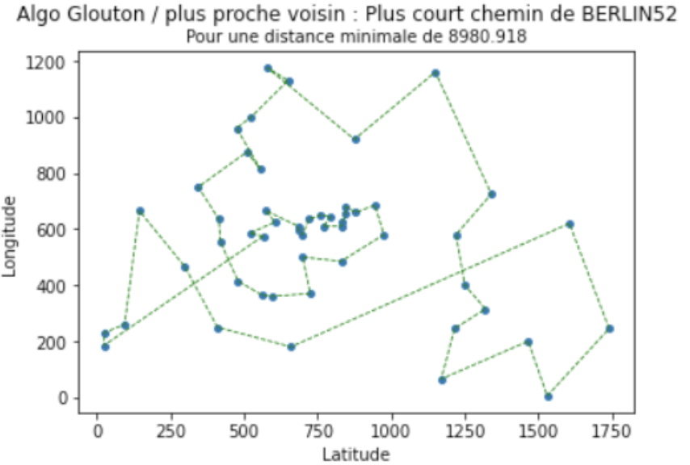
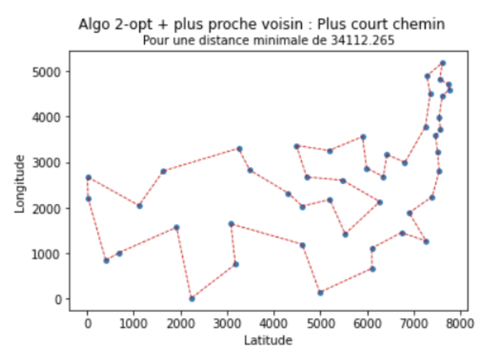
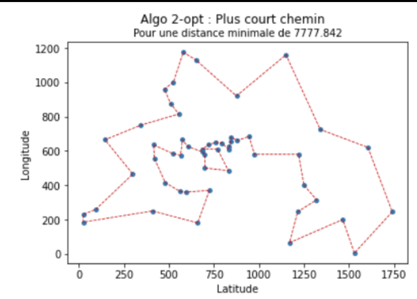
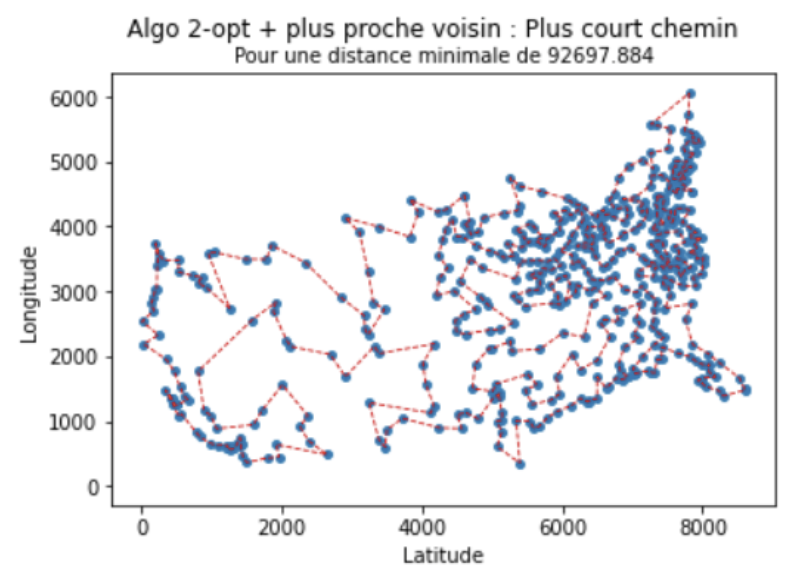

# Travelling-salesman-problem
Study and comparison of approximate solution methods, with proposal of a metaheuristic based on swarm intelligence concepts to find good approximate solutions in a reasonable time.

### Problem: Depending on the application, are certain approximate resolution algorithms preferable to others? 
Objective: implement an algorithm that gives us a relatively short path in a reasonable time.

1. The nearest neighbor heuristic. This greedy algorithm builds the cycle by growing a chain. It starts from an arbitrary vertex and moves on to its nearest neighbor, then from there to its nearest unvisited neighbor, and so on ...., until all vertices have been traversed, at which point it returns to the start.

  
  

The NNH algorithm finds a cycle that is on average 25% longer than the best existing result.

 

2. The 2-opt algorithm : it is an iterative algorithm: at each step, two edges are removed from the current solution and the two towers thus formed are reconnected. Among other things, this method improves the cost of solutions by removing intersecting edges when the triangular inequality is respected.

  
  
  

3. Ant colony algorithm : COMING SOON 
